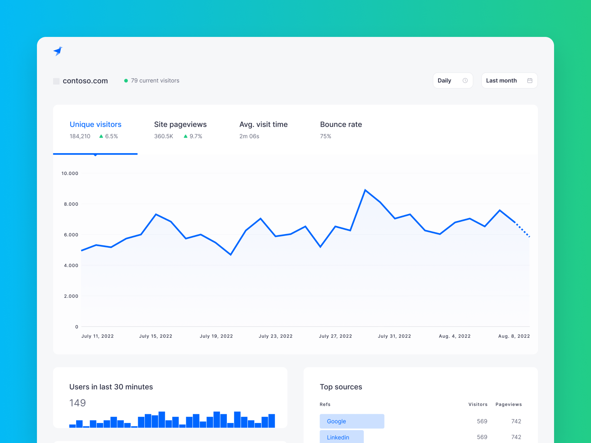
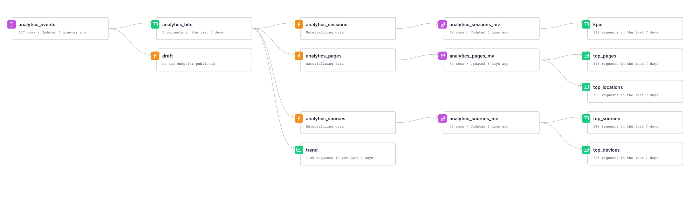
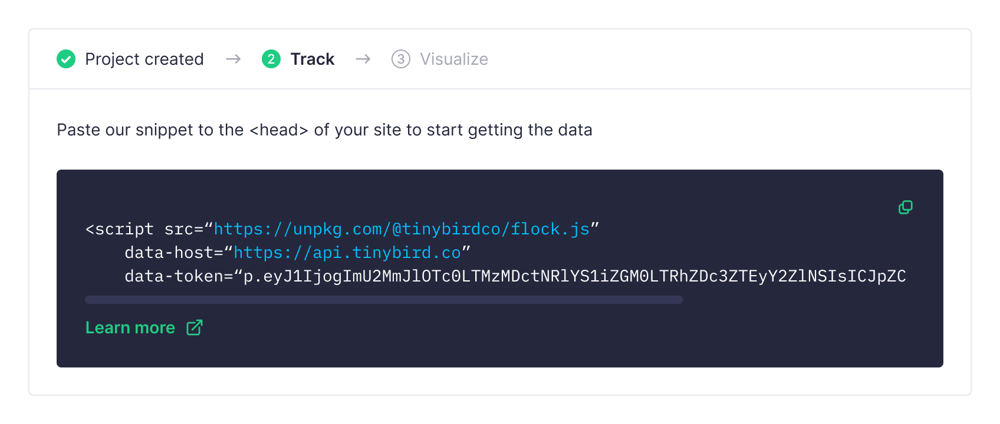
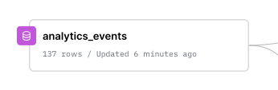
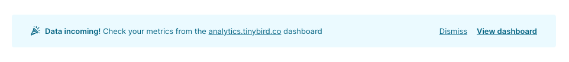

<p>
  <a href="https://www.tinybird.co/join-our-slack-community"></a>
</p>

# Tinybird Web Analytics Starter Kit

Build your own web analytics platform using [Tinybird](https://www.tinybird.co/)'s Events API and Endpoints. Built with privacy and speed as top priorities, this Starter Kit lets you get real-time metrics in a pre-built dashboard in just a few minutes without any knowledge about Tinybird. Our [free accounts](https://www.tinybird.co/pricing) serve up to 1000 requests per day and unlimited processed GB, more than enough to get started.

<!-- You can look at the [Web Analytics Starter Kit](https://www.tinybird.co/starter-kits) site to get a better glimpse of the final result.  -->

Once you've finished the basic setup, expand your analytics with custom events tailored to your specific use cases (eCommerce, marketing, etc.), keeping the same real-time performance. If you need to be GDPR compliant, check out the [GDPR best practices section](#gdpr).



## 1. Set up the data project

Click this button to deploy the data project to Tinybird 👇

[](https://ui.tinybird.co/workspaces/new?name=web_analytics&starter_kit=web-analytics-starter-kit)

Follow the guided process, and your Tinybird workspace is now ready to start receiving events. All your Data Sources, [Materialized Views](https://www.tinybird.co/guide/materialized-columns) (to make the queries blazing fast), and API Endpoints should be installed and ready. If you go to the Data Flow tab in your browser you should see something like this:



<!-- maybe add some explanations on top of the flow? -->

<details id='manual-install'> 
<summary><h4>Manual installation (alternative)</h4></summary>

1. Create a [Tinybird account](https://ui.tinybird.co/signup).
2. Create a Workspace and go to **Manage Auth tokens** to copy your admin token.
3. Clone this repository:

```bash
git clone https://github.com/tinybirdco/web-analytics-starter-kit
cd web-analytics-starter-kit
cd tinybird
```

4. Install the Tinybird CLI using `pip install tinybird-cli`. [Detailed instructions here](https://docs.tinybird.co/cli.html#how-to-install).

5. Authenticate on the CLI using `tb auth` and paste the token you just copied.

6. Push the project using `tb push`.

</details>

## 2. Send events to your data source

Copy the snippet from the banner, and paste it on your site `<head>`:



If everything is working correctly, you should start seeing rows in your Data Source as visitors view and interact with your website



And you're done! 🙌

<details id='manual-install'> 
<summary><h4>More details on the snippet</h4></summary>

The banner generates a snippet like this one, including the tracking script:

```html
<script
  defer
  src="https://unpkg.com/@tinybirdco/flock.js"
  data-token="YOUR_TRACKER_TOKEN"
></script>
```

Script parameters:

| Parameter         | Mandatory | Description                                                                                                                                                                                       |
| ----------------- | --------- | ------------------------------------------------------------------------------------------------------------------------------------------------------------------------------------------------- |
| `data-token`      | Yes       | Your `tracker` token. It's already created for you, you can find it on the Tinybird UI under "Manage Auth Tokens"                                                                                 |
| `data-proxy`      | No        | Your domain URL to proxy the request, if you follow the optional steps for "GDPR Best Practices"                                                                                                  |
| `data-host`       | No        | Tinybird host URL. Ddefaults to `https://api.tinybird.co/`, but could be `https://api.us-east.tinybird.co` or a dedicated cluster. The banner already generates the snippet with the proper host. |
| `data-datasource` | No        | If you iterate the landing data source, or you just want to ingest the event in a different one, you can specify the landing data source name.                                                    |

</details>

## 3. Visualize the metrics on a readymade dashboard

Now you'll see a banner with a link to the dashboard. Click to open it:



Alternatively, you can always navigate to https://analytics.tinybird.co/ and paste your `dashboard` token.

You'll find this `dashboard` token already created for you on the Tinybird UI, under "Manage Auth Tokens".

<details>
<summary><h2>Custom events (optional)</h2></summary>

> **Warning**<br> > **GDPR**: Don't track any personal (PII), ids, codes, or any other information that may lead to identify an individual (not even fingerprinting). Track only the essential events when needed, and use aggregated metrics.

The script also provides you with a function to send custom events. You can simply add this to your application at any point:

```js
Tinybird.trackEvent('add_to_cart', {
  partnumber: 'A1708 (EMC 3164)',
  quantity: 1,
})
```

You can also fork the dashboard project in this repository and create custom components for your new events. It's a Next.js project, so you can deploy it easily on [Vercel](https://vercel.com/).

> _Custom Ecommerce events examples coming soon!_

</details>

<details>
<summary><h2>Custom attributes (optional)</h2></summary>

You can include custom attributes in the import library snippet. Attributes name must have **tb\_** prefix. Every attribute included with this requirement would be saved in the payload column of your analytics_events datasource and will be included in every event. For example:

```js
<script
  src="https://unpkg.com/@tinybirdco/flock.js"
  data-token="TOKEN-ID"
  tb_customer_id="CUSTOMER_ID"
></script>
```

Would append customer_id:CUSTOMER_ID to the rest of variables saved in payload column.

</details>

<details id='gdpr'> 
<summary><h2>GDPR best practices (optional)</h2></summary>

> **Warning**<br> > **GDPR**: These are some tips to follow the GDPR guidelines, but compliance is not guaranteed. Follow these instructions and assess with your legal team. For more details on how to implement a privacy-first tracker for compliance, [read this](https://www.tinybird.co/blog-posts/privacy-first-google-analytics-alternative).

Requirements:

- Create your Tinybird Workspace in **EU** region.
- Don't track any personal (PII), ids, codes, or any other information that may lead to identify an individual (not even fingerprinting).
- Track only the essential events when needed.
- Use aggregated metrics, never at individual level (session).
- Your visitors should be able to opt out at ANY time.

### Instructions to make it a first-party solution

To make this a first-party solution end-to-end, you'll need to send the events to the data pipeline using your own domain. You'll own the data, and Tinybird won't analyze it in any way.

You will need to set up:

- A tracking script delivery under <!-- this seems incomplete? -->
- A proxy to Tinybird Events API

<!-- add an option to test with a data generator? -->

1. Deploy the [middleware](./middleware/) to Vercel.

   [](https://vercel.com/new/clone?repository-url=https%3A%2F%2Fgithub.com%2Ftinybirdco%2Fweb-analytics-starter-kit%2Ftree%2Fmain%2Fmiddleware&env=TINYBIRD_TOKEN&envDescription=Tinybird%20token%20needed%20for%20ingestion&project-name=web-analytics)

2. Fill in the `TINYBIRD_TOKEN` environment variable with the ingestion token you created in the basic setup.

3. Add a subdomain to your site, for example `events.example.com`. Most ad-blockers won't block a subdomain on your root domain, but just to be sure, avoid `analytics.example.com`, `tracking.example.com` or similar so anti-trackers don't block your requests.

4. Update the snippet from the basic setup to this, using your configured subdomain:

```html
<script
  defer
  src="https://events.example.com/index.js"
  data-proxy="https://events.example.com"
></script>
```

</details>

<details id='next'> 
<summary><h2>What's next?</h2></summary>

- **Need more inspiration?** Check out our upcoming [live coding session](https://www.tinybird.co/live-coding-sessions/google-analytics-free).
- **The big picture:** [How an eCommerce giant replaced Google Analytics for privacy and scale](https://www.tinybird.co/blog-posts/ecommerce-google-analytics-alternative)
</details>

## Deploying the dashboard to Vercel

If you want to customize & host your own dashboard, you can easily deploy the project to Vercel using the button below:

[](https://vercel.com/new/clone?repository-url=https%3A%2F%2Fgithub.com%2Ftinybirdco%2Fweb-analytics-starter-kit&project-name=tinybird-web-analytics-starter-kit&repository-name=tinybird-web-analytics-starter-kit&demo-title=Tinybird%20Web%20Analytics&demo-description=A%20privacy-first%20Web%20Analytics%20project%20built%20with%20Tinybird&demo-url=https%3A%2F%2Fanalytics.tinybird.co%2F&demo-image=https%3A%2F%2Fanalytics.tinybird.co%2Fbanner.png&root-directory=dashboard&integration-ids=oac_uoH2YyxhaS1H6UYvtuRbRbDY)

## Authors

- [Rafa Moreno](https://github.com/rmorehig)
- [Raquel Yuste](https://github.com/raqyuste)
- [Alasdair Brown](https://github.com/sdairs)
- [Kike Alonso](https://github.com/kukukaka)
- [Cameron Archer](https://github.com/tb-peregrine)
- [Javier Álvarez](https://github.com/xavijam)
- [Sergio Álvarez](https://github.com/saleiva)
- [Jorge Gomez](https://github.com/jorgesancha)
- [Alejandro Martin](https://github.com/alejandromav)

---

Need help?: [Community Slack](https://www.tinybird.co/join-our-slack-community) &bull; [Tinybird Docs](https://docs.tinybird.co/) &bull; [Email](mailto:kike@tinybird.co)
