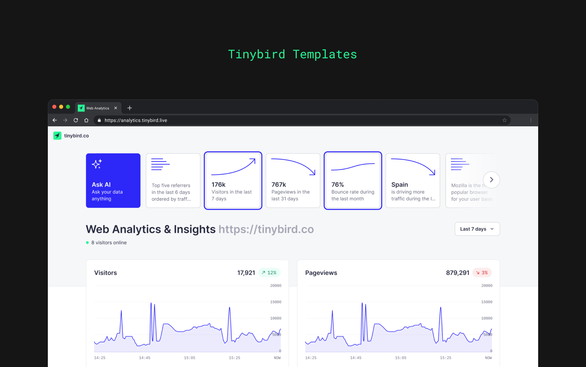

# Tinybird Web Analytics Starter Kit

Build your own web analytics platform using [Tinybird](https://www.tinybird.co/)'s Events API and Endpoints. Built with privacy and speed as top priorities, this Starter Kit lets you get real-time metrics in a pre-built dashboard in just a few minutes without any knowledge about Tinybird. Our [free accounts](https://www.tinybird.co/pricing) serve up to 1000 requests per day and unlimited processed GB, more than enough to get started.

<!-- You can look at the [Web Analytics Starter Kit](https://www.tinybird.co/starter-kits) site to get a better glimpse of the final result.  -->
Once you've finished the basic setup, expand your analytics with custom events tailored to your specific use cases (eCommerce, marketing, etc.), keeping the same real-time performance. If you need to be GDPR compliant, check out the GDPR best practices section.




## Basic setup

### Set up the data project

To get started in Tinybird, follow these steps:

1. Create a [Tinybird account](https://ui.tinybird.co/signup).
2. Create a Workspace and go to **Manage Auth tokens** to copy your admin token.
3. Clone this repository:

```bash
git clone https://github.com/tinybirdco/web-analytics-starter-kit
cd web-analytics-starter-kit
cd tinybird
```

4. Install the Tinybird CLI using `pip install tinybird-cli`. [Detailed instructions here](https://docs.tinybird.co/cli.html#how-to-install).

5. Authenticate on the CLI using `tb auth` and paste the token you just copied.

6. Push the project using `tb push`.

Your Tinybird workspace is now ready to start receiving events. All your Data Sources, [Materialized Views](https://www.tinybird.co/guide/materialized-columns) (to make the queries blazing fast), and API Endpoints should be installed and ready. If you go to the Data Flow tab in your browser you should see something like this:


<!-- maybe add some explanations on top of the flow? -->

### Send events to your data source

1. Go to your browser, click Manage Auth Tokens, and copy the `tracker` token.

2. Add the tracking script to your website, using that token:

```html
<script src="https://unpkg.com/@tinybirdco/flock.js" data-token="YOUR_TRACKER_TOKEN"></script>

<!--
  Alternatives:
  
  - Custom host (dedicated cluster, another region, etc.) 
    <script src="https://unpkg.com/@tinybirdco/flock.js" data-host="https://api.us-east.tinybird.co" data-token="YOUR_TRACKER_TOKEN"></script>

  - Append to another datasource
    <script src="https://unpkg.com/@tinybirdco/flock.js" data-datasource="analytics_events__v2" data-token="YOUR_TRACKER_TOKEN"></script>
 -->
```

If everything is working correctly, you should start seeing rows in your Data Source as visitors view and interact with your website


And you're done! 🙌

### Visualize the metrics on a readymade dashboard

In the Tinybird project, you'll find a `dashboard` token with all the required permissions to visualized your site metrics in our readymade dashboard.
Go to the following URL, customizing it with your `dashboard` token:

https://analytics.tinybird.co/?token={your-dashboard-token}


<details>
<summary><h2>Custom events (optional)</h2></summary>

> :warning: **GDPR**: Don't track any personal (PII), ids, codes, or any other information that may lead to identify an individual (not even fingerprinting). Track only the essential events when needed, and use aggregated metrics.

The script also provides you with a function to send custom events. You can simply add this to your application at any point:

```js
Tinybird.trackEvent('add_to_cart', {
  partnumber: 'A1708 (EMC 3164)',
  quantity: 1
});
```

You can also fork the dashboard project in this repository and create custom components for your new events. It's a Next.js project, so you can deploy it easily on [Vercel](https://vercel.com/).

> *Custom Ecommerce events examples coming soon!*

</details>


<details>
<summary><h2>GDPR best practices (optional)</h2></summary>

> :warning: **GDPR**: These are some tips to follow the GDPR guidelines, but compliance is not guaranteed. Follow these instructions and assess with your legal team. For more details on how to implement a privacy-first tracker for compliance, [read this](https://www.tinybird.co/blog-posts/privacy-first-google-analytics-alternative).

Requirements:

- Create your Tinybird Workspace in **EU** region.
- Don't track any personal (PII), ids, codes, or any other information that may lead to identify an individual (not even fingerprinting).
- Track only the essential events when needed.
- Use aggregated metrics, never at individual level (session).
- Your visitors should be able to opt out at ANY time.

### Instructions to make it a first-party solution

To make this a first-party solution end-to-end, you'll need to send the events to the data pipeline using your own domain. You'll own the data, and Tinybird won't analyze it in any way.

You will need to set up:

- A tracking script delivery under <!-- this seems incomplete? -->
- A proxy to Tinybird Events API

<!-- add an option to test with a data generator? -->

1. Deploy the [middleware](./middleware/) to Vercel.

    [](https://vercel.com/new/clone?repository-url=https%3A%2F%2Fgithub.com%2Ftinybirdco%2Fweb-analytics-starter-kit%2Ftree%2Fmain%2Fmiddleware&env=TINYBIRD_TOKEN&envDescription=Tinybird%20token%20needed%20for%20ingestion&project-name=web-analytics)

2. Fill in the `TINYBIRD_TOKEN` environment variable with the ingestion token you created in the basic setup.

3. Add a subdomain to your site, for example `events.example.com`.  Most ad-blockers won't block a subdomain on your root domain, but just to be sure, avoid `analytics.example.com`, `tracking.example.com` or similar so anti-trackers don't block your requests.

4. Update the snippet from the basic setup to this, using your configured subdomain:

```html
<script src="https://events.example.com/index.js" data-proxy="https://events.example.com"></script>
```

</details>


<details id='next'> 
<summary><h2>What's next?</h2></summary>

- **Need more inspiration?** Check out our upcoming [live coding session](https://www.tinybird.co/live-coding-sessions/google-analytics-free).
- **The big picture:** [How an eCommerce giant replaced Google Analytics for privacy and scale](https://www.tinybird.co/blog-posts/ecommerce-google-analytics-alternative)

</details>

##  Authors

- [Rafa Moreno](https://github.com/rmorehig)
- [Raquel Yuste](https://github.com/raqyuste)
- [Alasdair Brown](https://github.com/sdairs)
- [Kike Alonso](https://github.com/kukukaka)
- [Cameron Archer](https://github.com/tb-peregrine)
- [Javier Álvarez](https://github.com/xavijam)
- [Sergio Álvarez](https://github.com/saleiva)
- [Jorge Gomez](https://github.com/jorgesancha)
- [Alejandro Martin](https://github.com/alejandromav)

---

Need help?: [Community Slack](https://www.tinybird.co/join-our-slack-community) &bull; [Tinybird Docs](https://docs.tinybird.co/) &bull; [Email](mailto:kike@tinybird.co)
